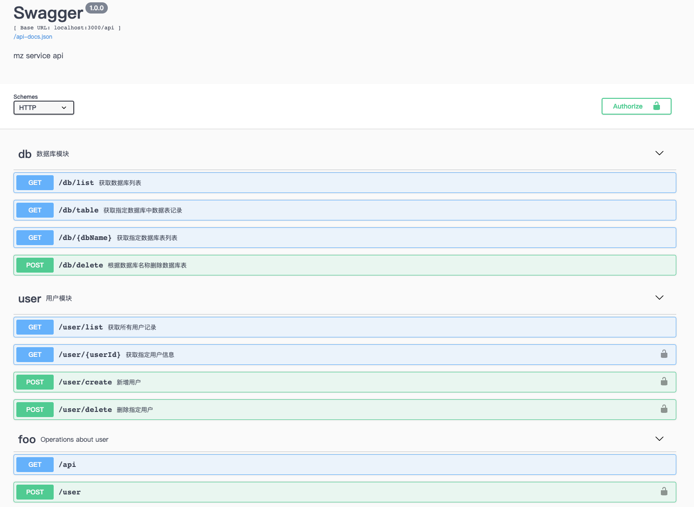

# mz-docker-service
基于docker构建的node服务

# 依赖
- docker
- docker-compose

# 运行
## 开发环境
1、先到backend目录下执行`npm install`安装依赖

2、运行容器
```
  docker-compose up
```

## 生产环境
```
  docker-compose -f docker-compose-prod.yml up
```

# swgger


# nginx
http://localhost:8080/xxx.png
http://localhost:8080/api/user/list

# node
http://localhost:3000/2_12.png
http://localhost:3000/api/user/list
